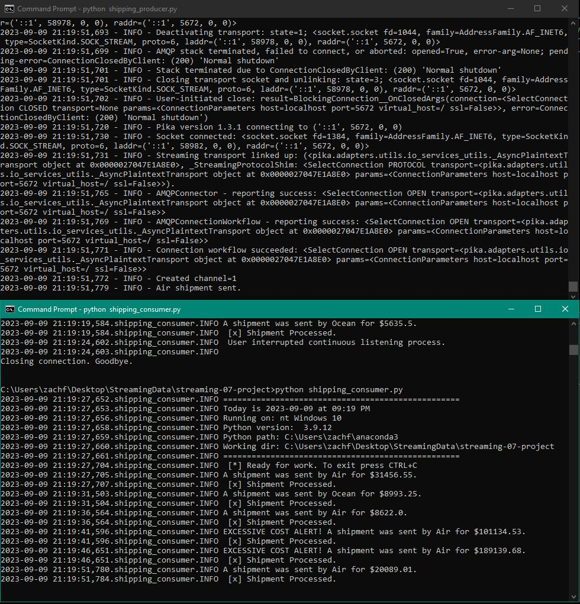
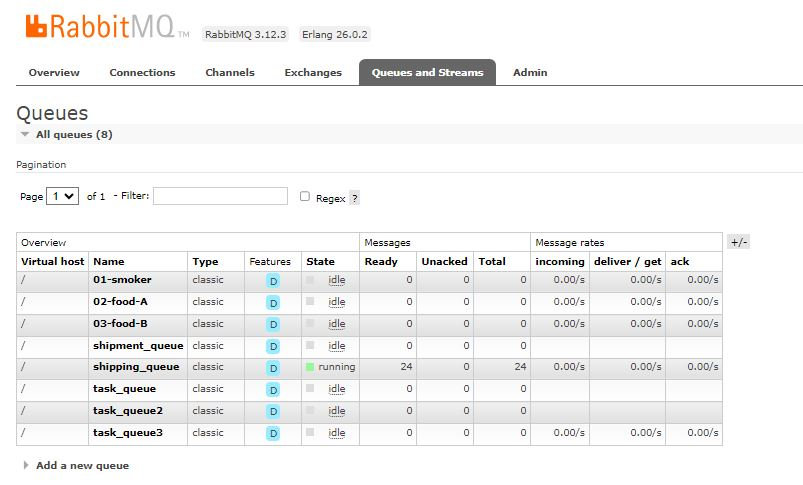

# streaming-07-project

# Simple Streaming and Cost Analysis of Shipping Data

## About

AUTHOR:
Zach Fuller

CLASS:
Streaming Data

PROGRAM:
Master of Science in Data Analytics

INSTITUTION:
Northwest Missouri State University

OVERVIEW:
During the course of this class, we have learned about the principles and different techniques associated with streaming data from various sources. We have focused on RabbitMQ and the associated Python package Pika as our message broker service. Using these tools, we have implemented streaming data pipelines to read and send data from local sources.

For my final project in this course, I built off of techniques used in previous assignments to stream data and provide simple analysis of a dataset I am familiar with. The Shipping Optimization Challenge dataset, linked below in the requirements section, was the main source of data for my Capstone class project. Given that I was familiar with the dataset, I wanted to see if I could get any more use out of it. The CSV stored in this repo is a simplified version of the original dataset found on Kaggle. One important aspect to note is that the column in the shipping.csv file provided, total_cost, is calculated by multiplying two of the original columns from the Kaggle dataset together, gross_weight and shipment_charges. With my previous analysis of this dataset in the Capstone course, I learned that the mean total cost was about $86,000 and the mode total cost was about $91,000. Knowing this, my plan was for this streaming application to send some type of special alert message when the total cost exceeded $100,000. In the real world, shippers want to know when their shipping costs go up so they can optimize their spending. This is a very simplified version of an alert system like that, but the general idea here is that shippers can be informed of high costs and act to reduce those costs.

## Requirements

PYTHON PACKAGES:
Pika
Sys
Webbrowser
CSV
Time
Logging
Util_logger (customer logging module included with this repo)

DATA:
Shipping Optimization Challenge - dataset hosted on Kaggle, submitted by Salil Gautam:
https://www.kaggle.com/datasets/salil007/1-shipping-optimization-challenge?select=train2pr.csv

## Process

This project is made up of two main pieces, the shipping_producer.py file and the shipping_consumer.py file.

### Producer

The shipping_producer.py file is an expanded version of my Module 4 project file, v3_emmiter_of_tasks.py. The simplified process taking place here is that a CSV file is taken as an input, and data from it's cells are sent out as messages. After importing the necessary modules and setting up some logging information, variables are declared, and we get to our custom functions.

The first of these, offer_rabbitmq_admin_site(), opens the RabbitMQ Admin site for visual tracking of our queue. The variable SHOW_OFFER is checked here, and if it is True (which I have it set to), it will automatically open the site. This variable can be changed to False if it is not needed.

The next function, send_message(), takes in some information read from the input CSV and writes a message based on what was in each row. This function is where a small bit of analytics comes in. The variable storing the total cost is one of the arguments here, and within the function, it is checked to see if it is greater than or equal to 100,000. If it is, than an extra message stating "EXCESSIVE COST ALERT!" is added to the beginning of the message sent. Otherwise, a standard message regarding the shipment mode and the total cost is generated and sent. This is also where we connect to the RabbitMQ channel and set configurations related to that. Using the time.sleep() function, messages are scheduled to be sent every 5 seconds.

The final function, read_shipments_from_csv() takes a file as an in put and iterates over each row in the source CSV file, assigning the row's values to variables. The variables are ensured to be the correct data type before they are fed into the send_message() function referenced above.

In the if __name__ == "__main__" section, the offer_rabbitmq_admin_site() function is ran first to automatically open the RabbitMQ Admin site. Then the read_shipments_from_csv() function is called, reading in the input CSV and carrying out the rest of the processes.

### Consumer

The shipping_consumer.py file is also an expanded version of a Module 4 project file, v3_listening_worker.py. The overall goal of this file is to read in (consume) the message sent by the producer file.

After the imports and logging configuration settings, the first function, callback(), is defined. This function decodes the body of the message sent by the producer and displays that message to the user.

Next, the function main() is defined. This is the function where the connection to RabbitMQ is opened and processed, calling on the queue named "shipping_queue" that was defined in the producer file. Within the basic_consume() function referened here, the callback() function is called.

In the if __name__ == "__main__" portion of this code, the main() function is called, taking the host (localhost) and the queue name as arguments.

## Output

To track the outputs, two separate terminals can be used, one running the producer file and one running the consumer file. The terminal running the producer will confirm that messages have been sent, and the terminal running the consumer file will display that message. The RabbitMQ Admin site can also be used as a visual confirmation that messages have been sent and received, but the contents of those messages will not be displayed.

